<div align="center">



</div>

<div align="center">


📡 [LinkedIn](https://www.linkedin.com/in/firdawsabiderrahmane) · ✉️ [firdaws.abiderrahmane@yahoo.com](mailto:firdaws.abiderrahmane@yahoo.com) · 🕹️ [GitHub](https://github.com/Namgeko)

</div>

---

### `whoami`

```yaml
nom:       Firdaws
alias:     Namgeko
formation: BTS CIEL, option Informatique et Réseaux (IR) — obtenu juillet 2026
objectif:  École d'ingénieur en alternance (3e année) — Cybersécurité / Réseaux
recherche: Alternance à partir de septembre / octobre 2026
passions:  Cybersécurité (CTF, Root-Me), Mécatronique, Sport, Jeux vidéo, Voyage
```

Fraîchement diplômée d'un **BTS CIEL IR**, je me spécialise en **cybersécurité et administration réseau**. Pendant mon stage à la Mairie de Tassin-la-Demi-Lune, j'ai déployé **seule** un SIEM Wazuh et géré l'authentification réseau — une expérience qui a confirmé mon envie d'aller vers un niveau ingénieur. Je cherche aujourd'hui une **alternance cybersécurité / réseaux** pour continuer en école d'ingénieur.

---

### 🛡️ Expérience

**Mairie de Tassin-la-Demi-Lune** — Stage Informatique, Réseaux & Cybersécurité
*Lyon | mai – juillet 2025*

- Déploiement en solo d'un **SIEM Wazuh** (agents, dashboards, alertes personnalisées)
- Administration serveur **Proxmox** (VMs, conteneurs)
- Gestion de l'authentification réseau (**RADIUS/NPS**, **Active Directory**)
- Diagnostic de pannes & support technique niveaux 1 et 2

---

### 🧪 Projets techniques

| Projet | Description | Stack |
|---|---|---|
| **SIEM Wazuh** | Déploiement complet pour la détection d'intrusions et supervision des logs | `Wazuh` `Detection Engineering` |
| **Lab cybersécurité perso** | Environnement virtualisé (Kali, cibles, LAMP) pour pentest et remédiation | `Metasploit` `Nmap` `Wireshark` |
| **Architecture réseau VLAN** | Segmentation réseau d'entreprise, réduction de la surface d'exposition | `Cisco` `VLAN` `ACL` |
| **Serre automatisée (IoT)** | Serre connectée pilotée par ESP32, interface de contrôle desktop | `ESP32` `Qt` `C++` |

---

### ⚙️ Compétences techniques

**Cybersécurité & Supervision**


**Réseaux, Systèmes & Services**


**Virtualisation, Web & Programmation**


---

### 📜 Certifications & Langues


-444444?style=for-the-badge&labelColor=020602)

| 🇫🇷 Français | 🇬🇧 Anglais | 🇸🇦 Arabe | 🇩🇪 Allemand | 🇯🇵 Japonais | 🇰🇷 Coréen |
|:---:|:---:|:---:|:---:|:---:|:---:|
| Natif | B2 | B1 | B1 | A1 | A1 |

---

### 📊 Statistiques GitHub

<div align="center">


</div>

---

### 🎮 Hors ligne

♟️ Cybersécurité (CTF, Root-Me) &nbsp;|&nbsp; 🥋 Kung-fu &nbsp;|&nbsp; ⚽ Football &nbsp;|&nbsp; 🛹 Skate &nbsp;|&nbsp; 🎮 Jeux vidéo &nbsp;|&nbsp; 🌍 Voyage

---

<div align="center">

*"Secure everything. Never stop learning."*

</div>
